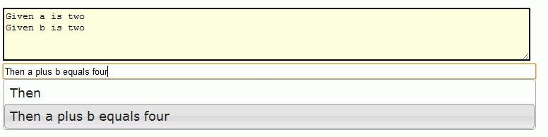

Gherkin IDE
======

Run:
   cd Cucumber; ruby steps-html.rb > ide.html
   
   <or>
   
   cd Cuke4Duke; groovy steps-html.groovy > ide.html
   
Open the ide.html in a browser. Begin typing. Tab will cycle to next option.  
</img>
